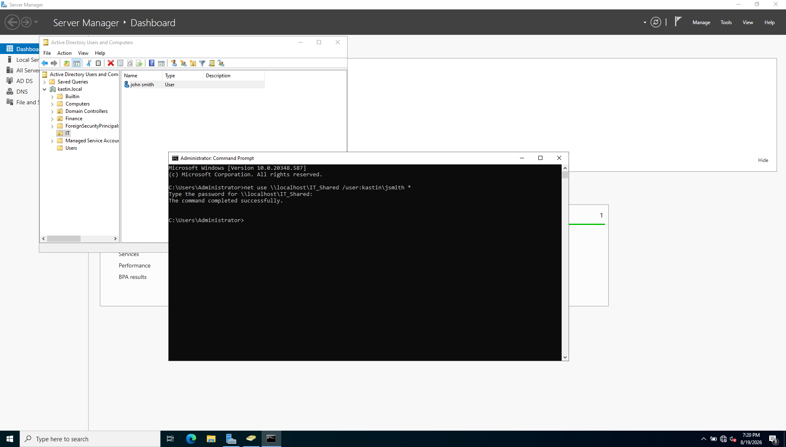

# Active Directory Security Monitoring Lab

## Project Status
🚧 Completed

## Objective
Build a Windows Active Directory lab to practice identity management, authentication monitoring, security log analysis, and investigation of suspicious login activities.

## Tools
- Windows Server
- Active Directory Domain Services (AD DS)
- Windows Event Viewer
- PowerShell

## Lab Activities
- Create and manage users and groups
- Configure Active Directory accounts
- Monitor successful and failed logins
- Analyze Windows security events
- Investigate suspicious authentication activity
- Practice basic account security and access control

## Skills Practiced
- Active Directory
- Windows Security
- Identity and Access Management
- Log Analysis
- Threat Detection
- PowerShell

## Documentation
### Lab Summary

This lab simulates common Active Directory identity and authentication security activities in a Windows Server environment.

### Activities Performed

- Created and managed the SOCTest Active Directory user account
- Created the SOC Analysts security group
- Added and removed the user from the security group
- Enabled and disabled the user account
- Performed password reset and account changes
- Generated multiple failed login attempts
- Investigated authentication and account activity using Windows Event Viewer

### Security Events Investigated

| Event ID | Description |
|----------|-------------|
| 4625 | Failed logon attempt |
| 4720 | User account created |
| 4722 | User account enabled |
| 4724 | Password reset attempt |
| 4725 | User account disabled |
| 4738 | User account changed |

### Failed Login Investigation

Multiple failed authentication attempts were intentionally generated for the SOCTest account.

Event ID 4625 was identified in Windows Security logs. The investigation showed multiple failed logon events associated with the test account, demonstrating how a SOC analyst can identify and investigate suspicious authentication activity.

### Key Findings

- Multiple failed logins can indicate suspicious authentication activity.
- Windows Event IDs provide important information for security investigations.
- Active Directory account and group changes can be monitored through Security logs.
- Event Viewer can help SOC analysts investigate identity-related security events.

### Conclusion

This lab provided hands-on experience with Active Directory administration, Windows Security event analysis, identity monitoring, and investigation of suspicious login activity.

## Lab Evidence

### 1. Audit Policy Configuration

### 2. Group Policy Application

### 3. Active Directory User Creation

### 4. Active Directory User Management

### 5. Active Directory Group Management

### 6. Active Directory Group Membership

### 7. Active Directory Account Monitoring

### 8. Security Event Monitoring

### 9. Windows Security Log Analysis

### 10. Failed Login Monitoring

### 11. Security Log Investigation

### 12. Account Creation Monitoring

### 13. Account Enable Monitoring

### 14. Password Reset Monitoring

### 15. Account Disable Monitoring

### 16. Account Change Monitoring

### 17. Security Event Investigation

### 18. Security Event Analysis

### 19. Security Event Review

### 20. Security Monitoring Evidence

### 21. Advanced Security Monitoring

### 22. Final Security Monitoring Review

### 23. Final Lab Evidence

